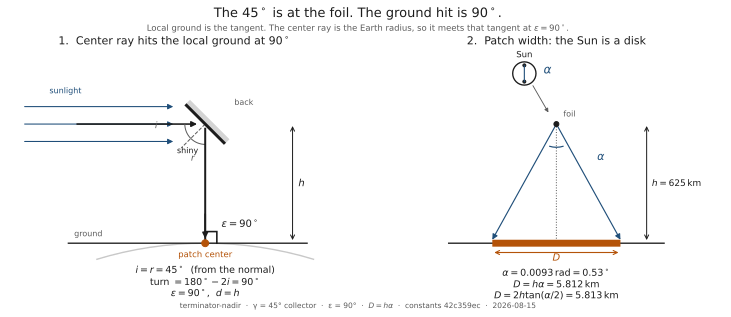
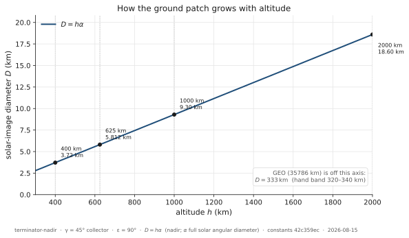
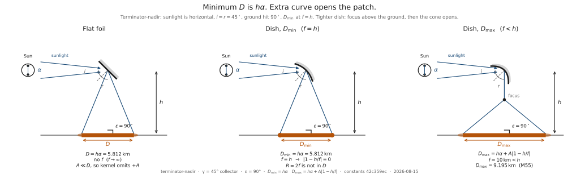
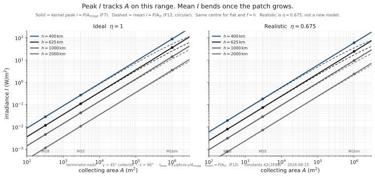
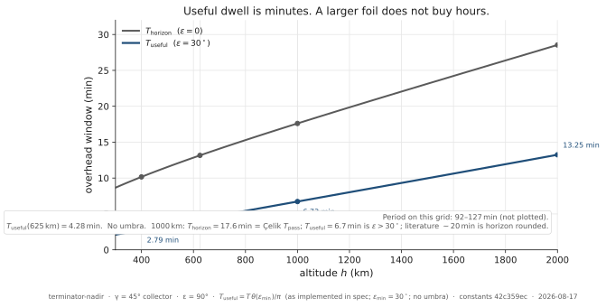

# Delivering reflected sunlight to a dark site

There is a picture that keeps coming back whenever someone talks about putting a mirror in orbit.

A city after sunset. The Sun has left the street, but not the sky above the horizon. A satellite still sits in daylight, on the moving line between day and night. Unfold a reflective sheet, tilt it, and reflect that leftover sun onto the ground. Night lighting without a power plant. Maybe as bright as a street. Maybe, if the sheet is big enough, something you could use to generate electricity, or put to some other purpose.

The idea seems straightforward enough.

Your brain immediately starts optimizing. Make the mirror bigger. Curve it. Aim it better. Launch more of them. Each of those instincts is reasonable. On Earth they are how light works: a larger lamp is brighter, a lens makes a hot spot, a flashlight points, and if one bulb is not enough you add bulbs.

That is the flashlight picture. It is so natural that the rest of the argument usually happens *inside* it. People debate the mirror — how big, how curved, how high, and how many of them. They almost never stop to ask whether the object in the drawing is a flashlight at all.

This note is a physics thought experiment about using mirrors in space to reflect sunlight onto locations on Earth. It is not an evaluation of any company, proposal, or real-world project, and it does not assume that such a system should or could be built. Suppose a mirror of a given size is placed in orbit at a certain altitude, with some allowance for losses in the reflection and in the air. How much sunlight could be redirected to a chosen location on Earth, over what area would it be spread, how bright would it appear at the surface, and how long would it last at a site that is already dark?

The goal is not only to calculate how much light reaches the ground. It is to see whether that light is useful. We will compare it with familiar benchmarks — moonlight, street lighting, and the sunlight needed to generate a meaningful amount of electricity. Those comparisons judge the scale. They do not change the physics.

Let’s start with the simplest version of the idea and see how it holds up as the physics comes into view.

---

## The flashlight picture

The intuitive picture is simple: a giant flashlight in space.

Imagine a 55-metre square mirror unfolding in orbit above Earth. The mirror points at a city and redirects sunlight to create a bright spot wherever light is wanted. At first glance, the idea seems plausible. Mirrors can reflect sunlight, and an object in orbit may still be illuminated by the Sun while the ground below is in darkness.

That mental model is powerful because it feels familiar. We already know that mirrors can throw bright patches of light across a room, across a field, or even across long distances. Why not scale the same idea up and do it from space?

The question is how closely the physics matches that picture. What actually sets the result is the Sun’s apparent size, the fact that the mirror does not hover, and the fact that a finite amount of sunlight is spread over a city-scale patch. The flashlight analogy is a useful starting point. It captures only part of the story.

---

## The two facts that matter

Two facts sit underneath the drawing, and neither can be engineered away.

**The Sun is not a point.** It is a half-degree-wide disk in the sky. Every optical system that “focuses sunlight” is really imaging that disk. On a windowsill the image is a few millimetres. The size of the image is set by how far away you put the screen.

**Satellites do not stop moving.** Low Earth orbit is roughly 7.5 km/s. Geostationary orbit does stop, in a sense — and we will see what that costs. Everything in between is a pass, not a hover.

Those two facts are why the flashlight picture keeps failing in the same places. Next come the most common objections or corrections that arise when that picture begins to break down.

---

## Myth #1: The mirror creates a spotlight

A flashlight has a lamp and a reflector. The lamp is small. The beam can be tight. Change the dish, change the spot.

An orbital mirror has no lamp. The source is the Sun. Incoming rays are parallel in the sense that the Sun is far away — but they are not infinitely sharp. The solar disk subtends \(0.0093\) radians, about half a degree. The mirror obeys the law of reflection. At the usual textbook snapshot the satellite sits on the day–night line, sunlit, looking straight down. The bounce angle at the mirror is 45° from the mirror’s **own face**, so the center ray turns 90° and hits the local ground at right angles.

That 45° is at the mirror, not at the ground. The sheet is already tilted 45° to the local tangent. Mixing those two angles is how the flashlight survives the first drawing: it makes people think they can “aim 45° at a city” as if the geometry were a lamp on a pole. The shiny face sees the Sun *and* the ground. The back faces space.

The left panel is that fold. The right panel is not a beam. It is an image.

Call it what it is: a **Sun projector, not a spotlight.** It does not create a new beam shape. It projects the solar disk onto the ground at the range of the mirror.

Since the Sun appears about half a degree wide in the sky, the projected image remains half a degree wide when viewed from orbit. At 625 km altitude, half a degree is a footprint nearly 6 km across — roughly the width of a large city district. The mirror may be the size of a building. The light is spread across about 26 square kilometres.

From height \(h\), looking straight down,

\[
D = h\alpha.
\]

At 625 km that is \(5.812\,\mathrm{km}\). The exact cone \(2h\tan(\alpha/2)\) is \(5.813\,\mathrm{km}\); we keep \(D=h\alpha\). Earth curvature under that 5.8 km patch is a sagitta of about \(0.7\,\mathrm{m}\) and a rim tilt of about \(0.03^\circ\). The ground is flat on this width. There is no tiny spotlight sitting in a curved bowl of city.

Raise the reflector and the image grows. Lower it and the image shrinks. Mirror size does not set \(D\). Fold angle does not set \(D\). Off-nadir, the range is the slant \(d\), so \(D=d\alpha\) still tracks range, which is no longer equal to height.

| \(h\) | \(D=h\alpha\) | what that is |
|---|---|---|
| 400 km | 3.72 km | still a city-scale disk |
| 625 km | 5.812 km | a large district |
| 1000 km | 9.30 km | a small city |
| 2000 km | 18.6 km | a metro width |
| GEO \(\approx 35786\) km | \(\approx 333\) km | a country-scale smear |

GEO is a size check, not an operating point. “Focus sunlight from geostationary orbit” means a third of a thousand kilometres on the ground. The projector still projects. The image is just farther away.

A finite sheet adds a rim of order the mirror width. That is a correction, not a way around the floor. “Small” here means the mirror is \(\le 1\%\) of the solar blur. At 625 km that 1% width is \(58\,\mathrm{m}\). An 18 m marker is small on the whole grid. A 55 m marker sits on the line at 625 km. A 1 km sheet is not small at 400–1000 km. Dropping the extra width while the mirror is small does not drop the Sun.

The footprint is determined by the Sun, not the mirror. The challenge is not making the spot larger. The image is already a city district.

---

## Myth #2: A curved mirror can focus it

At this point most people reach for the same escape hatch.

Fine, the Sun is large. Fine, the footprint is kilometres wide.

Just build a curved reflector.

We focus sunlight all the time. A backyard magnifying glass can burn paper. A solar furnace can melt steel. Why should orbit be different? The drawing even looks like a dish. Give it a focal length. Put the city at the focus. The 5.8 km disk collapses into a street.

The answer is subtle, because a curved reflector *really does* focus sunlight. It just does not focus the entire Sun onto the same point.

A magnifying glass works only because its focal length is short. The image forms a few centimetres away. An orbital reflector must project its image hundreds of kilometres to the ground. At that distance the solar image remains kilometres wide. Curving the reflector changes the edges of the image. It does not erase the blur caused by the Sun’s finite angular size.

Curvature doesn’t solve the problem because curvature isn’t the problem. The mirror isn’t failing to focus. It is already projecting exactly what physics allows.

A dish focuses **one point on the Sun** to **one point on the ground**. The Sun is a disk, so the other limb is a different direction and lands a different ground point. Put the solar image on the ground — focal length equal to altitude — and the two limbs are still \(h\alpha\) apart. At 625 km that is still \(D_{\min}=5.812\,\mathrm{km}\), same as flat. Collected power is still spread over that same circle, so centre brightness is the same. A 55 m dish and a 55 m flat sheet, aimed the same way, put the same watts on the same 5.8 km disk.

If you bend tighter, hoping to squeeze the city, the two limbs meet *above* the ground, then cross and spread. The footprint gets **bigger** and the middle gets **dimmer**. Extra curve is not a knob that shrinks the image. It is a way to open it.

The 1D lit width is

\[
D = h\alpha + A\bigl|1-h/f\bigr|.
\]

That has a **minimum** at \(f=h\). Flatten and you only add the aperture. Over-bend and \(D\) grows. At a stated \(f=10\,\mathrm{km}\) a 55 m illustration opens to \(9.195\,\mathrm{km}\); centre \(I\) falls from \(0.11\,\mathrm{W/m^2}\) to about \(0.044\). Curl a fixed-length mirror all the way toward a hemisphere and \(D\) peaks near \(4h\) — about \(2500\,\mathrm{km}\) at this snapshot — then pinches. When the rims meet, the shiny face is inside. Incoming sunlight hits the back. Collected power is zero. There is no lit patch. \(D\) is undefined, not infinite.

What the curve *does* change is the rim, not the middle. A flat mirror smears each Sun-point into a copy of the aperture, so the edge is a ramp. A dish at \(f=h\) makes the rim a step. Rim gain on a 1D cut is a factor of two, in a strip of width \(\sim A\). For the 55 m marker that strip is \(0.95\%\) of the patch — a fifty-five-metre border on a six-kilometre disk. Centre \(I\) is unchanged. Width \(D\) is unchanged.

And the “dish” at this scale is almost not a dish. Optimal radius is \(2h=1250\,\mathrm{km}\). Sag of a 55 m aperture on that sphere is \(0.30\,\mathrm{mm}\). Drawings enlarge the curve so you can see it. That millimetre is a figure note, not a reason the physics would change if the sheet were perfectly figured.

This is étendue, not a materials problem. You cannot take an extended source and a finite optic and produce a patch smaller than the solar image. The uses considered later all accept a patch of that size.

If you have forgotten the point of this section, it is this: **you cannot turn a Sun projector into a spotlight by bending the mirror.** It still projects the Sun.

---

## Myth #3: Bigger mirrors fix everything

The next instinct is the honest one. If the image is huge, get a bigger collector.

That instinct is not wrong. It is incomplete. A larger collector intercepts more sunlight. Those extra watts land on the *same* solar image while the mirror is small compared with the image, so centre brightness rises in proportion to area. Double the sheet, double \(I\). The 55 m marker is \(9.34\times\) the 18 m marker in area, and \(9.34\times\) in centre \(I\). Linear. Extra curve is not in the formula.

The key scale mismatch is easy to overlook.

The mirror may be the size of a building. The illuminated patch is the size of a city district. The mirror’s power is being painted onto an area thousands of times larger than the mirror itself.

> **The page is bigger than the lens.**

At 625 km, looking straight down, the solar image is \(26.53\,\mathrm{km}^2\). A 55 m square is \(3025\,\mathrm{m}^2\). The light is spread over an area almost nine thousand times larger than the mirror. An 18 m square is worse by another factor of nine: the same 26 km² disk, a sheet eighty thousand times smaller than the patch. That is why a few megawatts at the mirror is a tenth of a watt per square metre on the ground. The projector is not faint because space is far away. It is faint because the image is a city and the collector is a building.

At terminator-nadir the bookkeeping is

\[
I = \frac{E_0\,\eta\,A\cos\gamma}{A_\text{image}},\qquad A_\text{image}=\pi(D/2)^2,
\]

with \(E_0=1361\,\mathrm{W/m^2}\) and \(\gamma=45^\circ\). The mirror catches \(P=E_0 A\cos\gamma\). For the 55 m marker that is \(2.911\,\mathrm{MW}\), dumped into a 5.8 km disk, so centre brightness is \(0.1097\,\mathrm{W/m^2}\). Raise the orbit and the image grows as \(h^2\), so \(I\) falls as \(1/h^2\). Same watts, larger image.

Solid lines are the kernel peak; dashed lines are the mean on a growing sun-shadow once the mirror is no longer small. The two panels are \(\eta=1\) and \(0.675\). At 625 km, looking straight down, an 18 m square delivers \(0.01175\,\mathrm{W/m^2}\) ideal; a 55 m square delivers \(0.1097\,\mathrm{W/m^2}\). Full sun is about \(1000\,\mathrm{W/m^2}\). Moonlight-class here is \(0.003\). If those 55 m numbers feel unbelievable, look at the areas: a modest sheet, a 5.8 km disk.

So bigger *does* buy brightness. Keep buying. Daylight-class \(1000\,\mathrm{W/m^2}\) at \(\eta=1\) wants the mirror area over the solar-image area to be **1.039**. At 625 km the image is \(26.53\,\mathrm{km}^2\) and the mirror is \(27.57\,\mathrm{km}^2\). If you want the ground as bright as the original Sun, the projector has to be as big as the image it throws. Watts are conserved:

\[
\frac{A}{A_\text{image}} = \frac{I}{E_0\eta\cos\gamma}.
\]

That quotient does not depend on height. Brightness is diluted by \(A/A_\text{image}\), not by lamp inverse-square.

Then the instinct overshoots. A bigger mirror is not a better watts ratio. \(P_\text{ground}/P_\text{in}=\eta\) at every collecting area. Scaling the sheet catches more sunlight and dumps more watts into the patch; it does not raise the fraction kept. What *does* rise with \(A\) is W/m² on the ground, toward \(\eta E_0\cos\gamma\): \(962\,\mathrm{W/m^2}\) ideal, \(650\) with the estimated factor. That is a ceiling, not a proof that 1000 is unreachable, and not the solar constant \(1361\). \(A\to\infty\) with the image held fixed is bookkeeping. The real patch grows with the mirror, and a ground point cannot beat the Sun.

Once the mirror — or a stack of co-aimed copies — fills the solar image, more area in the same solid angle does not make more suns. Peak \(I\) follows the linear law until fill, then stays at that ceiling. Mean \(I\) is not linear: the growing outer patch offsets part of the extra watts. You can’t buy more Sun.

And notice what bigger did *not* do. The 55 m sheet and the 18 m sheet, at the same height, still share the same pass. The image got brighter. The satellite did not slow down. A larger mirror solves the brightness problem perfectly. It does nothing at all for how long the light lasts.

---

## Myth #4: One satellite can stay over a city

If brightness was the area problem, duration must be solvable too. Make the pass longer. Fly higher. Or just… stay.

Low Earth orbit does not stay. Period is \(2\pi\sqrt{a^3/\mu}\) with \(a=R_E+h\), not with \(h\) alone. The useful window is the fraction of that orbit with elevation above 30°, not horizon to horizon, and not the flash of an unsteered spot racing across the ground.

Collecting area does not appear in that window. The 18 m mirror and the 1 km mirror, same height, same track, same minutes. The building-sized projector still crosses the sky like a satellite, because it is one.

At 625 km an overhead pass is \(97.06\) minutes around the world, \(13.16\) minutes above the horizon, and \(4.281\) minutes above 30°. The useful line rises with height — \(2.786\,\mathrm{min}\) at 400 km, \(13.25\,\mathrm{min}\) at 2000 km — and never becomes hours on this grid.

A longer orbital pass *does* solve the duration problem. Raise the altitude and the minutes grow. They grow slowly. They also spend brightness: the image gets bigger as \(h^2\), so \(I\) falls. Higher is a trade, not a hover.

Papers that say “about twenty minutes at 1000 km” are rounding the **horizon** number. At 1000 km, \(T_\text{horizon}=17.61\,\mathrm{min}\). The 30° window is \(T_\text{useful}=6.727\,\mathrm{min}\). Horizon at 2000 km (\(28.54\,\mathrm{min}\)) would pass a twenty-minute test. Useful (\(13.25\,\mathrm{min}\)) would not. No overhead cell on this grid stays useful for 20 minutes. Three hours is not one satellite.

GEO would hover. GEO’s image is \(\approx 333\,\mathrm{km}\) across. The projector still projects. The city is a speck on that image.

And the “useful” window already assumes the image is **held on the site**. If the mirror stays nadir-pointed, the patch races past a ground observer in \(D/v\):

| \(h\) | \(D\) | unsteered cross |
|---|---|---|
| 400 km | 3.72 km | \(0.52\,\mathrm{s}\) |
| 625 km | 5.812 km | \(0.85\,\mathrm{s}\) |
| 1000 km | 9.30 km | \(1.46\,\mathrm{s}\) |
| 2000 km | 18.6 km | \(3.54\,\mathrm{s}\) |

Less than a second at the demo height. A reported orbital-mirror flash of that class is this number, not a 2.8-minute useful window. Pointing is the difference between a glint and a pass. This note does not design the pointer. It refuses to treat the glint as the pass. Pointing does not buy hours. It only spends the minutes you already had.

The product of peak brightness and useful time is an upper bound. For the 55 m sheet at 625 km nadir it is \(28\,\mathrm{J/m^2}\). That is not overnight energy for generating electricity, or for any other long-running use. The same 55 m sheet, still at nadir, can clear \(0.1\,\mathrm{W/m^2}\) and still fail a 20-minute test, because the pass is \(4.3\) minutes long. Matching the joules of a long pulse is not the same as lasting that long.

A longer pass solves the duration problem perfectly. It does nothing at all for brightness — and in low Earth orbit, “longer” is still minutes.

---

## Myth #5: Midnight is just an aiming problem

The flashlight picture has one more repair. The city is dark at 2 a.m. The satellite will be overhead at 2 a.m. Aim down.

A mirror can only bounce sunlight that is actually hitting it. At local midnight with the satellite overhead, low Earth orbit is usually in Earth’s shadow. The ground is dark *and* the mirror sees no Sun. There is nothing to bounce. Midnight is not an aiming problem. It is an eclipse.

The geometry that can light a dark city is different, and it is worse than the textbook snapshot. Keep the mirror on the terminator, still sunlit. Aim off-nadir into the night. The site is six degrees into darkness — after sunset, not 2 a.m. Longer path, larger solar image, steeper bounce at the mirror. Terminator-nadir, looking straight down, is still twilight on the ground. It is the brighter envelope, not the value case. Mixing those two snapshots is how dusk-overhead brightness gets quoted as night lighting.

At 625 km, civil-night \(I\) is \(0.150\times\) the terminator-nadir envelope — about a seven-fold penalty. The path is \(d=937.5\,\mathrm{km}\). Elevation is \(\varepsilon=38.74^\circ\). The bounce angle at the mirror is \(i=67.63^\circ\), not the frozen 45° of the dusk snapshot. The image is an ellipse about \(8.7\times 14\,\mathrm{km}\) (\(D_\text{minor}=8.719\,\mathrm{km}\), \(A_\text{image}=95.41\,\mathrm{km}^2\)) — a city, still, only larger. Useful dwell drops to \(2.809\,\mathrm{min}\) because the site is off the terminator track. Fainter image, fewer minutes.

An 18 m sheet then delivers \(0.001759\,\mathrm{W/m^2}\) and **misses** moonlight-class \(0.003\). A building-sized 55 m sheet makes \(0.01642\,\mathrm{W/m^2}\): enough for that moonlight bin, not enough for street-class \(0.1\,\mathrm{W/m^2}\). A 1 km sheet clears street-class brightness (\(5.429\,\mathrm{W/m^2}\)) and still fails twenty minutes — bright enough, not long enough. Switching on the estimated \(\eta=0.675\) does not change those letters. The one cell that used to look η-sensitive — 55 m versus street lighting — was a twilight artifact. On the night map, both optical columns fail that cell on energy.

At 400 km the same civil-night site never reaches 30° elevation (\(\varepsilon_\max=27.2^\circ\)). There is no useful pass. “Just fly lower,” which was supposed to shrink the image and brighten it, does not serve this night snapshot above the shutter. Deeper night (Sun \(12^\circ\) down) is below the shutter at 625 and 1000 km as well.

The table scores parked bins at 625 km civil night. **E** means peak \(I\) is short of the bin. **T** means brightness is enough but the useful window is not. **pass** means both. Spot size is not the test. The spot was never too small.

| Class | Target | 18 m | 55 m | 1 km |
|---|---|---|---|---|
| Moonlight | \(0.003\,\mathrm{W/m^2}\), one pass | E | pass | pass |
| Street-class | \(0.1\,\mathrm{W/m^2}\), 20 min | E | E | T (need 7.1 sequential passes) |
| Weak PV | \(50\,\mathrm{W/m^2}\), 20 min | E | E | E |
| Energy | \(200\,\mathrm{W/m^2}\), 3 h | E | E | E |
| Daylight | \(1000\,\mathrm{W/m^2}\) | E | E | E |

Energy-class is not a bigger 55 m mirror. At this night snapshot it wants a sheet of order \(3.7\times 10^7\,\mathrm{m^2}\) *and* a train of 64 useful windows. One filled-sun pulse here is about \(87\,\mathrm{kJ/m^2}\) against a three-hour energy target of \(2.16\,\mathrm{MJ/m^2}\). Canady’s nadir formulas are the envelope. His off-nadir path is this night snapshot. A published 18 m, 625 km, minutes-and-moonlight demonstration lives in the night column, not the dusk envelope. That is a geometry remark, not a review of anyone’s company.

If you have forgotten the point of this section, it is this: **you do not get midnight.** You get early night from a still-sunlit terminator, at a penalty, or you get Earth’s shadow and zero.

---

## The two currencies

Five myths. Two repairs that actually spend something.

A larger mirror solves the brightness problem perfectly. It does nothing at all for the duration problem.

A longer orbital pass solves the duration problem perfectly. It does nothing at all for brightness.

The uncomfortable part is that these multipliers barely talk to each other.

Call them **the two currencies.** Area buys brightness. Time buys duration. A train of mirrors along the orbit spends time. A giant reflector — or co-aimed copies on the same patch — spends area. Curvature spends neither. Pointing spends neither. Joules are not a third currency: a square of satellites can match the energy of a long pulse and still fail the minutes.

To hit both a brightness floor and a duration floor at one site,

\[
N_I=\frac{I^*}{I_\text{one}},\qquad N_T=\frac{T^*}{T_\text{useful}},\qquad N=N_I N_T
\]

while stacking is still linear. \(N_I\) is the area currency. \(N_T\) is the time currency. Grow \(A\) only until \(I=I^*\). After that, area drops out and only the train remains.

Watch the examples, now that the myths are gone:

- **Larger mirror, same duration.** 18 m and 55 m at 625 km share the same 2.8-minute night window. The 55 m image is brighter. The clock does not care.
- **Higher orbit, longer duration, lower brightness.** Raise 625 km to 1000 km and the street-class count of mirrors falls by about half: the extra minutes win over the dimmer \(I\). You traded area-currency efficiency for time-currency efficiency.
- **Train of mirrors, duration only.** Sequential passes. Street-class twenty minutes from a mirror already bright enough is \(N_T=7.12\) at 625 km. Energy-class is \(N_T=64\) of already-huge sheets. Three hours is a train everywhere on this LEO scan.
- **Giant reflector, brightness only.** Size the sheet to the brightness floor and the area count drops to one. Twenty minutes still wants the train, unless you go high enough that one pass is long enough — one satellite near 3000 km, with \(A\sim 8\times 10^4\,\mathrm{m^2}\).
- **Square versus train.** Street-class at 625 km, 18 m, \(\eta=1\): \(N_I=56.85\), \(N_T=7.12\), \(N=405\). Park all 405 in a square and you get \(0.712\,\mathrm{W/m^2}\) for \(2.809\,\mathrm{min}\). Fluence matches \(0.1\,\mathrm{W/m^2}\times 20\,\mathrm{min}=120\,\mathrm{J/m^2}\) and still fails the 20-minute test. A single-file train of 405 has the minutes and not the watts. Real abutting-train spacing is \(\Delta s=1272\,\mathrm{km}\) at 625 km, not a few mirror-widths. A cross-track square leaves the terminator. A sparse cloud around the ground target smears the \(8.7\times 14\,\mathrm{km}\) ellipse and dims the intended point.

At 625 km, ideal optics, one site: moonlight from 18 m is \(N=1.706\) — two mirrors, one pass. Street-class watts *and* twenty minutes is \(N=405\) of 18 m, or about 43 of 55 m, or one 1 km sheet plus a train of 7.1. 400 km has no night pass.

If the mirror is **stuck small** — 18 m or 55 m, not grown to the required area — the fewest satellites on this night snapshot do not sit at 625 km. Per-sat fluence \(I\,T_\text{useful}\) peaks near \(1420\,\mathrm{km}\). Street-class twenty minutes: 18 m goes from \(N=405\) at 625 km to **\(196\) at 1500 km** (210 at 2000 km). 55 m goes \(43\to 21\). An undersized 1 km sheet at the weak-PV floor goes \(66\to 32\). 625 km is the demo height, not the fleet minimum. That is geometry, not a launch-cost trade.

Past one filled solar image, extra copies in the square do not add suns. You still can’t buy more Sun.

---

## What the physics actually says

The industry keeps discussing mirrors. The governing constraints are solar angular size and orbital dwell time.

The reflector does not create a narrow beam. It projects an image of the Sun that is kilometres wide. **The mirror is a Sun projector, not a spotlight.**

The collected power is therefore spread thinly, and the satellite crosses the sky in minutes rather than hours.

Practical orbital illumination is governed by two quantities:

- **collecting area**, which determines brightness;
- **sequential passes**, which determine duration.

Neither mirror curvature nor clever pointing changes those limits. A larger mirror solves brightness and does not touch duration. A longer pass solves duration and does not touch brightness. The multipliers barely talk to each other.

A 55 m mirror at a convenient 625 km, looking straight down at dusk, is \(0.11\,\mathrm{W/m^2}\) — street-class brightness on a twilight snapshot, for four minutes if you steer, for under a second if you do not. Aim that same mirror into civil night and it is moonlight-class for one 2.8-minute window, and not street-class. An 18 m mirror at that night snapshot is **below** moonlight. Daylight from orbit is a mirror about the size of the image. The brightness ceiling is one resolved sun, reduced by \(\eta\) and geometry, not an infinite stack.

Any proposal that relies on a city-sized spotlight, a hovering satellite, multiple “stacked suns,” or continuous midnight illumination in low Earth orbit is no longer arguing with engineering constraints. It is arguing with geometry.

None of that says “do not build.” It says what the build is *of*: area until one sun, then time as a train; night as a slant, not as dusk overhead; 625 km as a picture, not as a minimum.

We did not integrate a light curve, retune the air for low elevation, subtract umbra along the pass, or price a launch. Those are open. They are not hiding in the tables as a silent no.

The thought experiment was to put those facts in order, on purpose, before the picture of the flashlight did the arguing.

---

## Appendix: conventions

Intensities are in W/m². \(\eta=1\) is the ideal envelope; \(0.675\) is one estimated clear-sky factor (\(\rho\tau=0.9\times 0.75\)), not a second atmosphere stacked on later. Energy per pass is peak \(I\) times useful time: an upper bound, not a light curve and not a harvest of electricity. When a count of mirrors appears, it is for **one site** and one night window, not a constellation to cover the Earth. Realistic \(\eta\) is still a zenith factor, not \(\tau(\varepsilon)\). Polar-summer exceptions and true midnight exist as geometry, not as this kernel. Packing many reflectors beyond the two multipliers is not priced and not drawn as a third physics. The reflector is a mirror — a thin reflective sheet. Technical papers sometimes call that sheet a foil; this note does not.

---

## Appendix: 625 km arithmetic

The hand sheet (`tests/hand_625.md`) is the calibration. Four significant figures. The code matches it to one percent. Nadir is the envelope; civil night is the value snapshot. Zero depression recovers the nadir row.

| Quantity | Nadir | Civil night (Sun \(6^\circ\) down) |
|---|---|---|
| Patch | \(5.812\,\mathrm{km}\) | \(8.719\,\mathrm{km}\) (minor axis) |
| Solar image | \(2.653\times 10^7\,\mathrm{m^2}\) | \(9.541\times 10^7\,\mathrm{m^2}\) |
| 18 m, ideal | \(0.01175\,\mathrm{W/m^2}\) | \(0.001759\,\mathrm{W/m^2}\) |
| 55 m, ideal | \(0.1097\,\mathrm{W/m^2}\) | \(0.01642\,\mathrm{W/m^2}\) |
| 18 m, \(\eta=0.675\) | \(0.007932\,\mathrm{W/m^2}\) | \(0.675\times\) the night \(I\) |
| Useful window | \(4.281\,\mathrm{min}\) | \(2.809\,\mathrm{min}\) |
| Horizon / period | \(13.16\,\mathrm{min}\) / \(97.06\,\mathrm{min}\) | period unchanged; window is off-track |

Diffraction is irrelevant next to \(D=h\alpha\): an Airy disk for a 10 m aperture at 550 nm and 625 km is about 4 cm.
